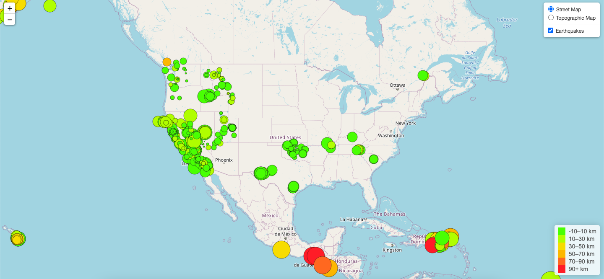

# leaflet-challenge

In this repository, a map was created based on USGS earthquake data using HTML and JavaScript with Leaflet. The map shows all of the earthquakes around the world in the past 7 days.

The map has two base maps (Street and Topographic) as well as an overlay for the earthquakes which can be toggled on or off.

The circle markers representing the earthquakes are color coded based on the depth, and a legend is provided to provide context. Additionally, the larger the circle is the higher the magnitude of the earthquake. By clicking an earthquake, a pop-up will show you the location, magnitude, and the date and time that the earthquake occurred.

A screenshot of the final map is provided below.

